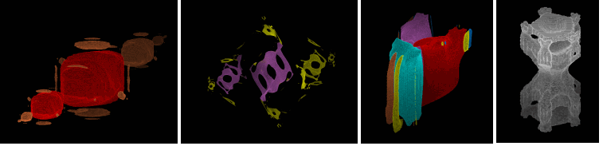

# juliatsa3d-core

3D Julia sets with a mathematical guarantee



Extension of the articles into R<sup>3</sup>:

```
"Images of Julia sets that you can trust"
by Luiz-Henrique de Figueiredo, Diego Nehab, Jofge Stolfi, Joao Batista Oliveira-
from 2013

"Rigorous bounds for polynomial Julia sets"
by Luiz-Henrique de Figueiredo, Diego Nehab, Jofge Stolfi, Joao Batista Oliveira-
```

## Purpose of this C++-code:

Command line tool to compute multivariate polynomial Julia sets with triplex numbers in R<sup>3</sup> using
cell mapping and interval arithmetics.

### Disclaimer

Although I tried my best to ensure correctness of the implementation and therefore the results,
the code comes with no warranty.

## README is organized as:

0. Quick start 
1. Short background information on the algorithm and the current implementation
2. Computing some example sets explaining the features of the code
3. Command-line parameters
4. Limitations
5. Contact and links
6. Functions implemented


## (0) Quick starting example:

Compile main.cpp with any suitable C compiler supporting 64-bit integers (best with mathematical optimizations
for speed enabled). 

Start executable (assuming it is called juliatsa3dcore_d.exe throughout README - d stands for the C++ double datatype,
other types see (1)) by entering in a command prompt:

`juliatsa3dcore_d.exe func=makin len=8 cmd=period c=-1,0,0 range=2`

The file `_L08__makin_c_ia_-1_-1_x_0_0_x_0_0.bmp` contains a 24-bit bitmap with the computed set, viewed
from a standard position above one corner of the world cube. Bright purple is the immediate basins, yellow is
the attraction basin, showing a period-2 attracting cycle.

Or start the batch file `_basilica_makin.bat`. This constructs the basilica in 3 increasing refinement levels,
using already computed data and saves 3 bitmaps.


## (1) Background

Tiny cubes in R<sup>3</sup> are judged as definite interior or exterior according to the above articles
(see detailed description in my project juliatsacore).

The main purpose here is to identify attracting periodic cycles and their immediate basins.

The software first tries to find a file named `_in.raw`. If that exists
the raw data is loaded and computation will be resumed with the already judged cells. 

A special case is when the read-in data was computed with half the current command line screen
width. In that case the read-in data is doubled, every voxel is copied to a 2x2x2 grid keeping
its color if applicable (otherwise set to gray) and computation resumes in the higher screen width - simulating the refinement process as described in the article - and saving a lot of time when trying to calculate a large set. 

The output of the code are several files:

`_L08__makin_c_ia_-1_-1_x_0_0_x_0_0.bmp`
	which is a 24-bit bitmap representing the view onto the 3D set, usually the interior. 

`_3d.raw'
	The final raw data is stored in that file, which can be used to resume computation in a higher refinement level (see example below).

`_temp.raw`
	Ever so often temporary data is stored so computation can be stopped by closing the program and resuming it later on by
renaming that file to _in.raw and using the same command (see example below).

During computation, progress and results are written to a log file named "juliatsa3dcore.log.txt".

Number representability is a prerequisite for the coefficents given in the command line, 
any value p/q where q is a power
of 2 can be accurately represented. Numbers provided are internally made
representable by performing: floor(number provided * 2^25) / 2^25.

The desired and necessary C++ data type for the computation of the bounding box can be commented in or out
at the start of the source code:

`#define _DOUBLE`

`#define _LONGDOUBLE`

`#define _QUADMATH`

and then recompiling to ensure enough precision to not encounter rounding errors.

The software performs a preliminary check if the currently
used C++ data type is offering enough bits for the current resolution,
function and triplex number range.

Memory is allocated in a row-based manner from first to last occurance of a gray cell at read-in time from the
data. Some sets have very filigree and isolated interior regions and can be computed to a higher level than others.

If interior cells were found, a short notice is printed on the screen.

When the final raw data has been saved ("Safe to close window), the program can be terminated by closing
the command window, e.g. when the image is not needed at that refinement level (e.g. if no interior cells were found).

Main output is the information about cycles and a 2D bitmap that has been deduced from the computed 3D cube
by sending a virtual screen through space picking up colors as the screen intersects with visible parts of the object.
Colors are dimmed according to distance to observer and angle of
normal surface vector to observer view axis (straight to the middle of the world cube).
The internal viewer can be switch off by using the TWDB=n command line parameter (see below).

In the lower left corner of the image are some colored rectangles. Two adjacent ones represent one 
cycle - the left color being the immediate
basin, the right color the attraction basin. 


## (2) Examples and features

#### (a) Computing small sets from scratch

Enter the following line in a command prompt.

`juliatsa3dcore_d.exe cmd=calc func=makin c=-1,0,0 len=8 range=2`

which is one of the fastest sets to compute.


#### (b) Resuming computation

Start a computation with the following command:

`juliatsa3dcore_d.exe cmd=calc func=makin c=-1,0,0 len=9 range=2`

Note the larger len value. At some point the message *saving temporary data" appears. If the computation
continues after that, close the command-line window before the image is calculated
completely.

The software saved the file `_temp.raw`. 

Rename that into "_in.raw" and start the computation again with the same command. The software then continues judging
pixels using all the information that has been calculated thus far (message "reading data and allocating memory").

Delete the `_in_raw` file if no longer needed as the software always first tries to use this file if present.

#### (c) Increasing an image to a higher screen width

Compute a small version of the basilica (deleting `_in.raw` beforehand).

`juliatsa3dcore_d.exe len=8 cmd=calc c=-1,0,0 func=makin range=2`

Rename the final files `_3d.raw` to `_in.raw`

Then start the software again with double the screen width, i.e. len=9 and changing the command to cmd=period:

`juliatsa3dcore_d.exe len=9 cmd=period c=-1,0,0 func=makin range=2`

The software uses the already computed image to build a bigger version. Afterwards delete `_in.raw`.

(d) interesting sets

Some interesting parameters. Note, the len value is the lowest at which interior cells are found. For speed reasons,
computation
should be done in an increasing len order starting from e.g. 8 as described in paragraph (c) above.

- 3 fixpoints
`juliatsa3dcore_d len=8 func=tricz4b cmd=period ci=0,0,-6710887 ai=36909875,36909875,36909875 bi=-6710887,-6710887,-6710887 range=2`

- period-6 cycle
`juliatsa3dcore_d func=MAKIN len=14 cmd=period c=-1.13427734375,0.237548828125,-0.00244140625 range=2 twdb=3`
<b>Note</b>, this set needed around two days to be fully computed and analyzed for cycles. It uses the
external viewer.

- period-3 cycle
`juliatsa3dcore_d len=11 cmd=period func=bristor range=2 c=-0.109375,-0.734375,-0.234375 range=2`

- period-2 cycle
`juliatsa3dcore_d func=MAKINEXP4 len=9 cmd=period c=-1.09375,0.1875,-0.984375 range=2 a=-0.25,-0.25,-0.25 b=0.5,0.5,0.5`


## (3) Command-line parameters

`FUNC=string` (if not provided, standard value is MAKIN)
The desired function to use. Implemented are the functions in paragraph 5.

`CMD=string` (standard value PERIOD)
1. CMD=CALC: The software computes the set, saves the final data and an image of the interior if
found (in yellow color) or the gray region, in case no interior could be detected. After saving
temporary data, the computation can be interrupted and resumed later.

2. CMD=PERIOD (or CMD=BASIN): The software tries to find the immediate basins of attracting periodic points if present
and colors them as well as the attraction basins. If no _in.raw file is present, the set is calculated from scratch.

For the first 4 different cycles, the following color combinations are used (immediate / attraction basin):
(I have not encountered more than 3 cycles at once so far up to level 14).

- bright purple / yellow
- bright red / brown
- bright turquois / pale blue
- light green / dark green

For further cycles a shuffled version of a color palette is used (untested).

<b>Note:</b>Cycle detection currently cannot be interrupted and resumed.

`LEN=integer` (standard value 8)
	The cube is set to 2^LEN x 2^LEN x 2^LEN voxels.
	Images should be at least 2^8 pixels and can go up to 2^31 in principle. The largest I computed thus far is, however, 2^14 pixels in width for specific sets if memory is sufficient.

'C=doublex,doubley,doublez` or
`C=doublex0,doublex1,doubley0,doubley1,doublez0,doublez1` or
`CI=nx,ny,nz` or 
`CI=nx0,nx1,ny0,ny1,nz0,nz1`

	Sets the seed value to a triplex number (3 values provided) or an interval (6 values).
	The double values are made representable as described earlier, the CI values are interpreted
	as 64bit integers and serve as the enumerator of a rational with constant denominator 2^25.
	E.g. nx is converted to nx*2^-25 as floating point. This comes in handy for some values which would
	need numerous digits after the decimal point.

`A=doublex,doubley,doublez` or `B=doublex,doubley,doublez`
`AI=nx,ny,nz` or `BI=nx,ny,nz`
	Some functions use additional triplex parameters. Notation as for C value.

`E,F,G,...Q=double`
	Further one-valued parameters.
	Note, those values can currently not be entered as an intger enumerator like A, B or C.

<b>Note:</b> Floating point numbers given in the command line as parameters are always treated as C++ double, no matter 
what underlying data type is used in the binary.

`RANGE=integer` (standard value 4)
The cube in R^3 where the whole Julia set is definitely contained is set to -RANGE .. +RANGE in
every axis. (See limitations).

`GRAY`
The internal viewer depicts the shape of the gray cells in space, no matter if interior cells are present (then
standard would be to show the interior cells) or not.

`TWDB=n`
This disables the internal viewer and thus does not construct a final image. It saves bitmap-type data in a file
named "bc1.ccb" (no interior cells present) or "bc1per.ccb" (present) that can be used in my cube-viewer project
to show the objects from different observer positions.

The value n is the downscale factor 2^n: Tiny cubes of 2^n x 2^n x 2^n voxels are analysed. If all pixels have
the same color, the resulting final one voxel is set to that color, otherwise to gray.

The ccb-files can be visualized by `cube-viewer cmd=show file=bc1.ccb observer=1` to show the gray
region's shape or `cube-viewer cmd=show file=bc1per.ccb observer=1 transp=250,250,250,255,255,255` to
show the interior cells (see batch file _external_viewer.bat which requires the cube-viewer project to be downloaded).


## (4) Limitations
- Every voxel needs 2 byte of space. Maximal refinement level is 31 for a cube of 2^31 x 2^31 x 2^31 voxels. However, my current maximum used is level 14.
- Although the internal viewer can handle large images (up to 2 TB) I hardly use it above level 11, as my naive
implementation would need ages to move through the world cube. In higher refinement levels the external viewer and using TWDB=some value is recommended.
- The external cubeviewer is best used with cubes of no more than 2^11 x 2^11 x 2^11 voxels, hence a suitable TWDB=n
value should be provided. Although higher side length might be possible (not tested rigorously), the 2^11 cube
needs already about 24 GB of file space.
- The software was designed mainly for speed and complete memory usage. If an error occurs, it prompts a message and exits immediately "dirty", leaving garbage collection to the operating system.
- Cycle detection starts in every refinement level anew. Therefore cycle assigned colors can differ.
- Only the C value can currently be used as a triplex interval, A and B are triplex numbers and the other variables
E to Q con only be provided as simple floating point values.


## (5) Contact

Please direct cycle record numbers, implementation errors or any comments in general to:

marcm200@freenet.de

forum: https://fractalforums.org/image-threads/25/3d-julia-sets-true-shape/3047

Marc Meidlinger, November 2019


## (6) Functions implemented

Formulas used are from:
(1) www.bugman123.com/Hypercomplex/index.html#JuliaQuaternion
(2) fractalforums.org/fractal-mathematics-and-new-theories/28/brand-new-method-for-true-3d-fractals/3118
(3) constructed by me

Iteration is defined as: {x,y,z}_new := f({x,y,z}_old} + { C1,C2,C3 }

Note: A1 etc denotes the x-value of the 3d-parameter A as given by the command-line, A2 the y-value etc. Other values are named accordingly.

<table>
<tr><td>func=</td><td>author</td><td>formula f</td></tr>
<tr><td>MAKIN</td></td>David Makin, 1</td><td></td></tr>
<tr><td>BAIRD</td></td>Eric Baird, 1</td></td></tr>
<tr><td>BAIRD5</td></td>3</td><td>A1*x+x^3-3xy^2-z^2,<br>A2*y+3yx^2-y^3,<br>z^3-y^3-x^3</td></tr>
<tr><td>BRISTOR</td></td>Doug Bristor, 1</td></tr>
<tr><td>MAKINEXP4</td></td>3</td><td>x^4-y^4-B1*z^2,<br>A2*x+2xy,<br>z^4-x^2*y^2</td></tr>
<tr><td>MAKINEXP4B</td></td>3</td><td>x^5-y^5-B1*z^4,<br>A2*x+2*x^2*y^2,<br>z^2-y^2-x^2</td></tr>
<tr><td>MAKINEXP5</td></td>3</td><td>M*x^2+x^3-2*N*xy-M*y^2-3*x*y^2+H*z^2,<br>N*x^2+2*M*xy+3*x^2*y-N*y^2-y^3,<br>2xz-2yz</td></tr>
<tr><td>SMITH</td></td>Tyler Smith, 2</td></tr>
<tr><td>TRICZ3B</td></td>3</td><td>A1*x+x^3-3xy^2-B1*z^3,<br>A2*y+3x^2*y-y^3,<br>z^3-y^3-x^3</td></tr>
<tr><td>TRICZ4B</td></td>3</td><td>A1*x+x^4-6x^2*y^2+y^4-B1*z^2,<br>A2*y+4x^3*y-4y^3*x,<br>z^3-y^3-x^3</td></tr>
<tr><td>TRICZ5D</td></td>3</td><td>A1*x+B1*z^2+x^5-10x^3*y^2-5x*y^4,<br>E*y+5*x^4*y-10*x^2*y^3+y^5,<br>z^2-y^2-x^2</td></tr>
</table>

